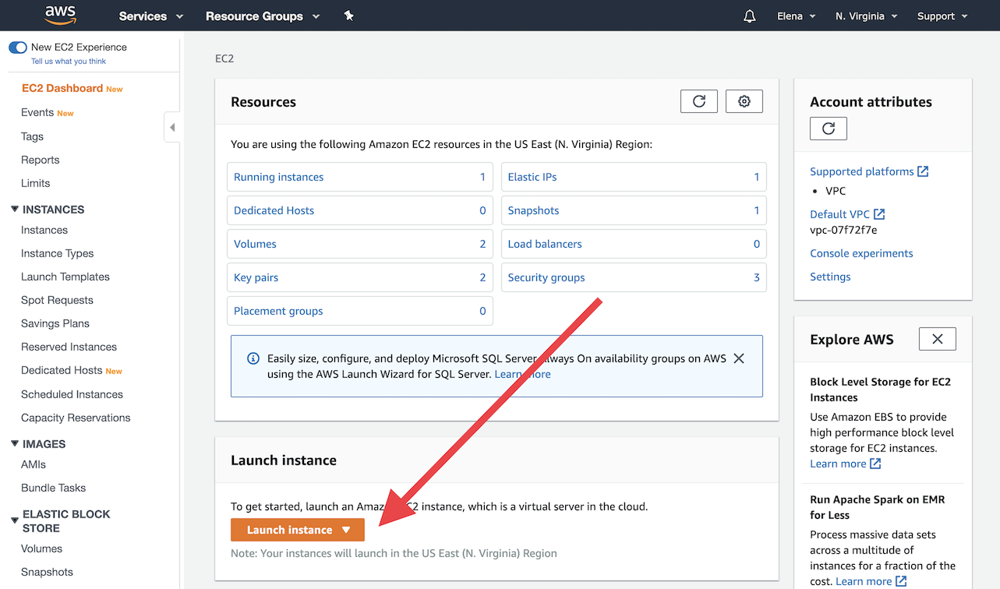
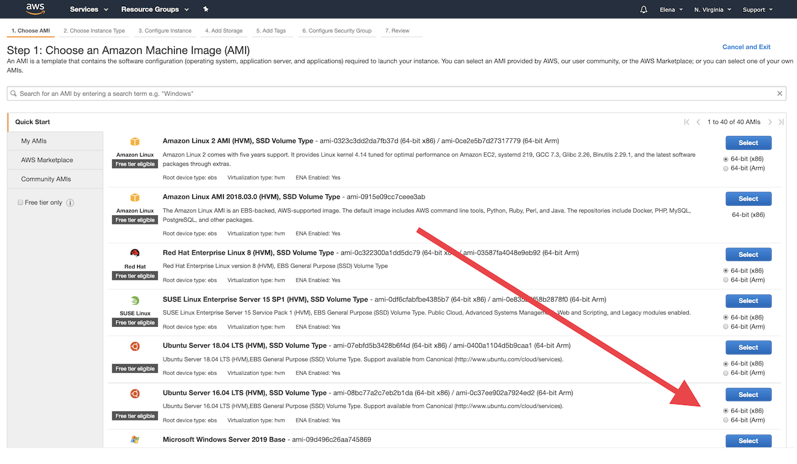
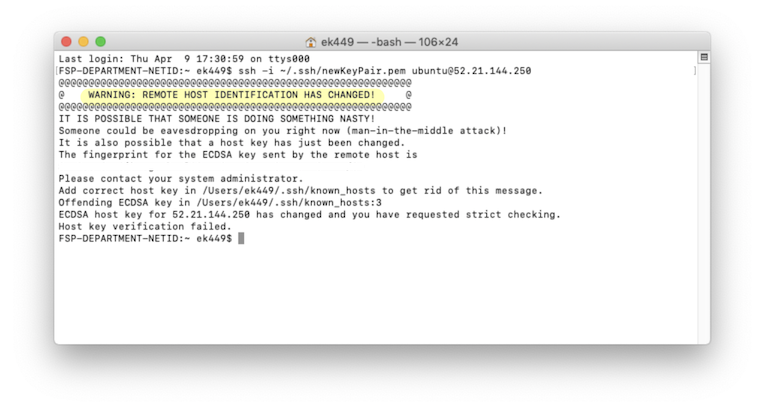

There are plenty of resources online to guide you through the process of 
creating an instance on AWS. 
Here is another one that I compiled while launching my EPI shiny app.
I avoid using clients for server-laptop communication as it adds another level 
of confusion for me.
Instead I use Terinal (macOS) and bash commands.
The final script (together with other files mentioned here) can be downloaded 
from my github page.

**Disclaimer**: This is the second time I did it and I don't have much 
experience with servers/shell etc, thus chances are there are mistakes and 
sub-optimal approaches below. 
Let me know if you find any and I'll update this note. 

# Step one -- Launching an Instance

## Start

Go to your account on <a href="https://console.aws.amazon.com/ec2/v2">AWS</a> and click Launch instance button

## AMI
Next window will prompt you to choose AMI (Amazon Machine Image). 
I choose Ubuntu Server 16.04 LTS (HVM), SSD Volume Type, 64-bit version.
It qualifies for free tier and satisfies all my needs.

## Instance type

Next window is asking for the type of the Instance. Use default and don't press "Launch"! Instead go to "3. Configure Instance"

## Disable "Auto-assign Public IP"

Here you want to disable "Auto-assign Public IP": This would allow you to have constant IP (we will assign it later) to be associated to your instance, otherwise a new IP would be assigned every time the instance is restarted.

## Security Group

Next we go to "6. Configure Security Group" and open a Shiny port (3838). 
The result should look like this:

## Launching

Click "Review and Launch". 
The review page would warn you that your instance is too open. 
I don't mind that, so I go forward and press "Launch".

### Key pair

Now you will be prompted to create and save a key pair (security file used to connect to the server from a local machine -- laptop)

Save the file in the ~/.ssh folder. **Hint**: use cmd+shift+G to locate the folder. 
Then click "Launch Instances" again.
Alternatively, you could use one of the older key pair if you still have access to it.

The instance is launched. It might take some time for it to actually become active:

* pending:

* initializing:

* checked and ready for work:

# Step two -- Associating Elastic IP with the instance

AWS assigns some IP to the instance once it's launched, and releases this IP 
once the instance is terminated. 
It might cause unwanted behaviour: As IPs are being reused you might end up 
having traffic causes by the previous owner of  your IP. 
Also if you ever terminate and then relaunch an instance it would get a new IP. 
To avoid that you can request an Elastic IP (EIP) that would be only
yours.
Note though that you might be charged if you reserve an EIP but don't associate 
it with any instance (not much, but still). 

When we disabled "Auto-assign Public IP" option, we prevented a random IP to be 
assigned to our instance.

To request a new EIP, under **NETWORK & SECURITY** choose Elastic IPs and press "Allocate Elastic IP Address", then press "Allocate" again.

Now you have your own Elastic IP, and you can associate it with the instance:
Choose the instance and press "Associate"

And we are done with launching the server. 
Now we will install all the necessary software for the Shiny app on it. 
We will be using Terminal (I am working on macOS) and bash script to do that.

# Step three -- Installing R and RShiny

## Accessing the server

Open a Terminal window and ssh to the Amazon instance (using .pem file we downloaded earlier).

(if the file is too open you might fisrt need to run 
"chmod 600 ./ssh newKeyPair.pem" in the terminal:
This would limit the access to the file and solve the "openness".)

Now, we are into the server:

## Getting the bash script to the server

We need now to get our bash script for installing R, RShiny and fetching the app 
itself, to the server. 
I keep all that stuff on my github page, feel free to take it, modify it, 
reuse it, etc

First, we get the root user privileges by typing "sudo su" and then fetch the 
script from github using bash command "wget". 
By the way, by running "man sudo" you can see the help page on the command 
(type "q" to exit the help page). 

Now if we type "ls" we can see all the files in the current directory, that is 
only the file that we just uploaded. 
Note its color -- black. 
It means the file is not executable and we need to change that by running 
"chmod +x InstallRandRShiny.sh".

Finally, we can execute the whole script by running "./InstallRandRShiny.sh".
The process takes some time and you will be asked several times to either hit
"Return"-button or agree with installation. Hit and agree.

If everything works, after the script is done, you can access your shiny app 
from your browser at http://ip-number:3838. 
For example, for my shiny app it would be http://34.204.30.96:3838.

## Understanding the script

I will now put some comments here about the bash script to explain what it's 
doing.
The script I provide started from the one I got from Jay Emerson when I was 
taking his class in Statistical Computing at Yale University.
I changed the script quite a bit as I didn't need lots of the functionality of 
the original one, and needed something else.

By no means am I an experienced bash user, so take everything here with a grain 
of salt. On the other hand, the script does the job.

First we do some preliminary work:

Lines 7 and 9 might need updating for the current versions of Ubuntu and R.
Line 10 is needed to get access to Ubuntu archives on CRAN (more <a href="https://cran.r-project.org/bin/linux/ubuntu/">here</a>).
Also note command "apt-get update" -- it updates all the installed packages. 
There is a similar command, that might be useful -- "apt-get upgrade" -- it 
might install newer versions of the packages (more <a href="https://askubuntu.com/questions/94102/what-is-the-difference-between-apt-get-update-and-upgrade">here</a>). 

Then we install R (more <a href="https://cran.r-project.org/bin/linux/ubuntu/README.html">here</a>):

and we install packages needed for RShiny to work and, finally, RShiny itself:

Line 43 ensures that the version of dplyr is 0.8.3 (and not later).
It has something to do with the fact that dplyr needs a lot of memory to 
compile, thus usually cached versions are used.
On the other hand, after new version is released, it takes some time for cache to 
becomme available, thus it might not compile (more <a href="https://community.rstudio.com/t/install-packages-dplyr-fails-on-new-project/55787">here</a>). 

Next part is optional: I need certain packages for my shiny app.

The last part is to just get the app and files it uses to the server 
(note the location -- shiny-server). 
Command "mv" renames (or **m**o**v**es) the file.
Delete or comment out the following code if not needed. 
Also, I had some problems long ago when I tried to store my app in 
two pieces: ui.R and server.R. 
Having just one app.R is safer.
Additionally, .r and .R are different!

# Trouble shooting and hints

## Changed host

If you have already accessed this IP in the past, but with different instance, 
you might see the following error:

The way to repair is to change the known_host file also located in ~/.ssh:
Just delete the entries with the same IP address and save:

## Formatting Instance

As far as I know it's impossible to format an Instance, but there is a 
workaround through snapshots and reattaching volumes.

When you create a new instance, take a snaphot of the clean volume attached to 
the instance (under **Snapshots** on Amazon EC2 Dashboard: https://console.aws.amazon.com/ec2/v2/home).

Then in order to "format" instance do the following:

* stop the instance

* detach the volume

* create new volume from the "clean" snapshot

* attach the volume to the instance

* restart the instance

